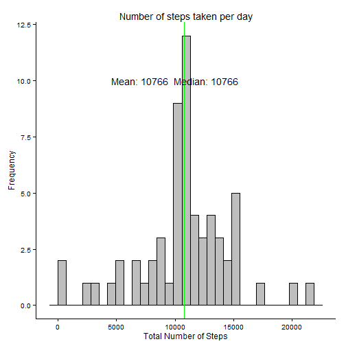

**This report contains answers the questions of assignment #1 for the Coursera Reproducible Research class.**

###Loading & Preprocessing Data

0. Load R-libraries and set Locale "English"


```r
library(dplyr)
```

```
## 
## Attaching package: 'dplyr'
## 
## The following objects are masked from 'package:stats':
## 
##     filter, lag
## 
## The following objects are masked from 'package:base':
## 
##     intersect, setdiff, setequal, union
```

```r
library(ggplot2)
Sys.setlocale("LC_ALL","English")
```

```
## [1] "LC_COLLATE=English_United States.1252;LC_CTYPE=English_United States.1252;LC_MONETARY=English_United States.1252;LC_NUMERIC=C;LC_TIME=English_United States.1252"
```

1. Load the data


```r
dat = read.csv('activity.csv', header = T)
names(dat)
```

```
## [1] "steps"    "date"     "interval"
```

```r
str(dat)
```

```
## 'data.frame':	17568 obs. of  3 variables:
##  $ steps   : int  NA NA NA NA NA NA NA NA NA NA ...
##  $ date    : Factor w/ 61 levels "2012-10-01","2012-10-02",..: 1 1 1 1 1 1 1 1 1 1 ...
##  $ interval: int  0 5 10 15 20 25 30 35 40 45 ...
```

```r
head(dat)
```

```
##   steps       date interval
## 1    NA 2012-10-01        0
## 2    NA 2012-10-01        5
## 3    NA 2012-10-01       10
## 4    NA 2012-10-01       15
## 5    NA 2012-10-01       20
## 6    NA 2012-10-01       25
```

2. Process/transform the data (if necessary) into a format suitable for your analysis

### What is mean total number of steps taken per day?

1. Calculate the total number of steps taken per day

2. Make a histogram of the total number of steps taken each day, but summarize the data by day:

3. Calculate and report the mean and median of the total number of steps taken per day


```r
dat_tbl <- dat %>% 
           group_by(date) %>% 
           summarise(total_steps = sum(steps, na.rm = TRUE))

lb1 <- paste("Mean:",
             round(mean(dat_tbl$total_steps),0), 
             " Median:", 
             round(median(dat_tbl$total_steps,0)))

h1 <- ggplot(dat_tbl, aes(total_steps)) + 
      geom_histogram(colour = "black", fill = "grey") +
      ggtitle("Number of steps taken per day")+
      theme_classic()+
      xlab("Total Number of Steps")+
      ylab("Frequency")+ 
      geom_vline(aes(xintercept = mean(dat_tbl$total_steps)), colour = "blue", lwd = 2)+
      geom_vline(aes(xintercept = median(dat_tbl$total_steps)), colour = "green", lwd = 2)+
      annotate("text", x=10000, y=10, label=lb1, parse=FALSE)

h1
```

```
## stat_bin: binwidth defaulted to range/30. Use 'binwidth = x' to adjust this.
```

 


### What is the average daily activity pattern?

1.  Make a time series plot (i.e. type = "l") of the 5-minute interval (x-axis) and the average number of steps taken, averaged across all days (y-axis)
2.  Which 5-minute interval, on average across all the days in the dataset, contains the maximum number of steps?


```r
dat_tbl_interval <- dat %>% 
                    group_by(interval) %>% 
                    summarise(average_steps = mean(steps, na.rm = TRUE))

max_steps <- dat_tbl_interval[which.max(dat_tbl_interval$average_steps), ]

h2 <- ggplot(dat_tbl_interval, aes(interval, average_steps)) +
      geom_line() +
      ggtitle("Average Steps by Time Interval ")+
      theme_classic()+
      xlab("5 Minute Time Interval") +
      ylab("Average Number of Steps") +
      geom_point(data = max_steps, color = "red", size = 3) + 
      geom_text(data = max_steps, 
                label = "   Maximum of 206.2 Steps On 835th Interval", size = 2, color = "red", hjust = 0)

h2
```

 

### Imputing Missing Values

1. Calculate & Report The Number of Missing Values

```r
sum(is.na(dat$steps))
```

```
## [1] 2304
```

2. Devise a strategy for filling in all of the missing values in the dataset. The strategy does not need to be sophisticated. For example, you could use the mean/median for that day, or the mean for that 5-minute interval, etc.

**I will use the mean**

3. Create a new dataset that is equal to the original dataset but with the missing data filled in.

```r
dat_tbl_better <- merge(dat, dat_tbl_interval, by = "interval")

#create new dataset that replaces NAs with average values of interval

dat_tbl_filled <- dat_tbl_better %>% 
                  mutate(steps_filled=ifelse(is.na(steps), 
                                             average_steps, 
                                             steps)) %>% 
                  group_by(date) %>% 
                  summarise(total_steps = sum(steps_filled, na.rm = TRUE))
```

4.  Make a histogram of the total number of steps taken each day and Calculate and report the mean and median total number of steps taken per day. Do these values differ from the estimates from the first part of the assignment? What is the impact of imputing missing data on the estimates of the total daily number of steps?


```r
lb1 <- paste("Mean:",
             round(mean(dat_tbl_filled$total_steps),0), 
             " Median:", 
             round(median(dat_tbl_filled$total_steps,0)))

h3 <- ggplot(dat_tbl_filled, aes(total_steps)) + 
  geom_histogram(colour = "black", fill = "grey") +
  ggtitle("Number of steps taken per day")+
  theme_classic()+
  xlab("Total Number of Steps")+
  ylab("Frequency")+ 
  geom_vline(aes(xintercept = mean(dat_tbl_filled$total_steps)), colour = "blue")+
  geom_vline(aes(xintercept = median(dat_tbl_filled$total_steps)), colour = "green")+
  annotate("text", x=10000, y=10, label=lb1, parse=FALSE)

h3
```

```
## stat_bin: binwidth defaulted to range/30. Use 'binwidth = x' to adjust this.
```

 

**Answer To Question:**
The mean and the median are now almost the same after replacing missing values with the mean value.

###Are there differences in activity patterns between weekdays and weekends?

1.  Create a new factor variable in the dataset with two levels - "weekday" and "weekend" indicating whether a given date is a weekday or weekend day.


```r
dat_tbl_day <- dat_tbl_better %>% 
               mutate(dayname = weekdays(as.Date(date))) %>% 
               mutate(daytype = ifelse(dayname %in% c('Saturday', 'Sunday'), "weekend", "weekday")) %>%  
               group_by(daytype, interval) %>% 
               summarise(average_steps = mean(steps, na.rm = TRUE)) 
```

2. Plot both levels

```r
h4 <- ggplot(data = dat_tbl_day, aes(x=interval, y=average_steps)) +
      facet_grid(daytype ~ . ) + 
      geom_line() + 
      theme_classic()+
      xlab("Interval")+
      ylab("Number of Steps")
h4
```

 
